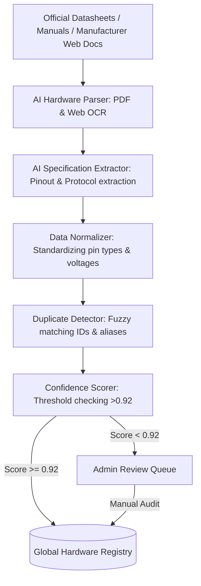
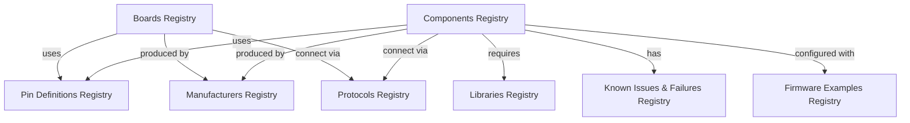
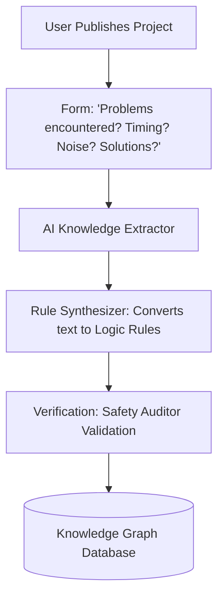
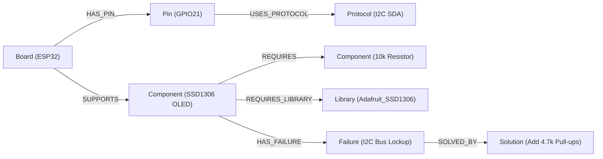
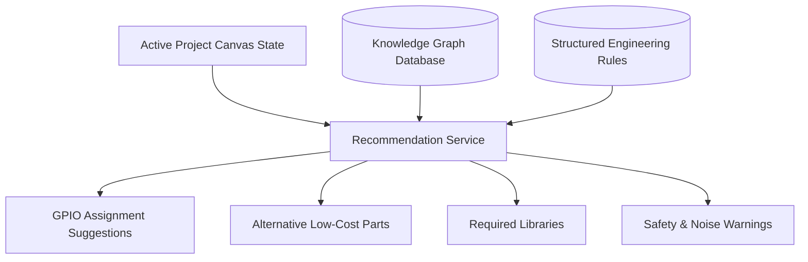
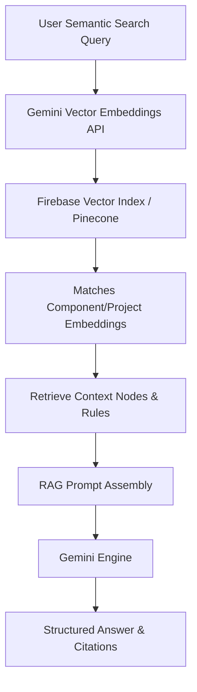

# Enterprise Architecture Blueprint: AI Embedded Systems Engineering Platform

This document defines the production-grade, highly scalable software architecture, data structures, and implementation specifications for the platform.

---

## 1. AI Hardware Knowledge Pipeline

The AI Hardware Knowledge Pipeline extracts structured, verified engineering data from unstructured documents and catalogs it into the **Global Hardware Registry**.



### Pipeline Details
- **AI Hardware Parser**: Implements layout-aware document intelligence to parse tables, pin tables, and schematic symbols from PDFs, manufacturer web tables, and SVG diagrams.
- **Specification Extractor**: Employs Gemini to scan tables and text. It isolates operating voltages, current limitations, hardware protocols, multiplexing flags, and register maps.
- **Data Normalizer**: Normalizes units (e.g., `mA` to `A`, `3300mV` to `3.3V`) and standardizes terminology (`VCC`, `VDD`, `3.3V` -> `Power 3.3V`).
- **Duplicate Detector**: Cross-references part numbers (e.g., `ESP32-WROOM-32D` vs `ESP32D`) using string distance algorithms to avoid registry pollution.
- **Confidence Scoring**: Assigns a reliability index (0.0 to 1.0) based on extraction clarity. Elements below 0.92 require administrator approval.

---

## 2. Expanded Modular Hardware Registry Service

The Hardware Registry Service decouples different hardware registry domains. Each registry refers to other domains by unique Firestore document IDs instead of copying records.



### Modular registries index:
- **Development Boards**: Form factor, pin headers, processor, power systems.
- **Electronic Components**: Sensors, actuators, indicators, controllers.
- **Pin Definitions**: Mapping logical designations, operating limits, and alternate pin multiplexing functions.
- **Libraries**: Drivers, dependencies, compatible architectures.
- **Manufacturers**: Official company profiles, manufacturer contact records.
- **Protocols**: Physical bus requirements, voltage standards (I2C, SPI, UART, CAN).
- **Firmware Examples**: Reusable hardware-initialization scripts.
- **Engineering Rules & Failures**: Edge cases, bugs, noise issues, thermal rules.

---

## 3. Community Knowledge Learning Engine

The Community Knowledge Learning Engine parses user design experiences on published projects to formulate global engineering rules.



### Experience-to-Rule Translation Example:
- **User Input**: *"I had to add a 10uF capacitor between VCC and GND on the SG90 motor. Otherwise, when it spun, it drew too much current and reset my ESP32."*
- **AI Synthesis**: Generates a structured rule: `Component(SG90) + Board(ESP32) -> Needs(Decoupling Capacitor 10uF) on Power Line to prevent Brownout Reset`.
- **System Impact**: When future users pair an ESP32 with an SG90 motor on the canvas, the system prompts them to verify power stability and add decoupling capacitors.

---

## 4. Engineering Knowledge Graph

We store and query the network of hardware relations using a graph-like schema inside Firestore.



### Relationship Storage Model (Firestore Nodes & Edges)
Edges are stored in a dedicated `knowledgeGraph` collection mapping relations:
- `source`: Document reference (e.g. `/components/esp32`)
- `target`: Document reference (e.g. `/protocols/i2c`)
- `type`: `string` (`SUPPORTS`, `HAS_PIN`, `REQUIRES`, `HAS_FAILURE`, etc.)
- `metadata`: Map of auxiliary weights, statistics, and occurrences.

---

## 5. Recommendation Engine Architecture

The Recommendation Engine parses the active layout and queries the Knowledge Graph to suggest corrections and components dynamically.



---

## 6. Search Architecture & RAG Pipeline



- **Embedding Generation**: Vector representations of registries and project files are stored in `searchEmbeddings`.
- **Retrieval**: User queries match against database records to dynamically assemble safety or architectural contexts.

---

## 7. Expanded Firestore Database Architecture

Below is the design spec for the 21 collections.

### 1. `users`
- **Purpose**: User accounts, metrics, and reputation.
- **Relationships**: One-to-many with `projects`.
- **Indexes**: Composite on `reputationScore DESC, createdAt DESC`.
- **Security**: Owner can read/write; public can read.
- **Example Document**:
```json
{
  "uid": "usr_001",
  "displayName": "Ada Lovelace",
  "photoURL": "https://avatar.com/ada.png",
  "email": "ada@engineering.org",
  "reputationScore": 1420,
  "createdAt": "2026-07-02T12:00:00Z"
}
```

### 2. `boards`
- **Purpose**: Core microcontrollers index.
- **Relationships**: References `manufacturers` by ID.
- **Indexes**: Single-field on `name`.
- **Security**: Read-only for public; writeable by admins.
- **Example Document**:
```json
{
  "id": "brd_esp32devkit",
  "name": "ESP32 DevKitC",
  "manufacturerId": "mfr_espressif",
  "operatingVoltage": 3.3,
  "description": "ESP32 development board"
}
```

### 3. `components`
- **Purpose**: Index of sensors, screens, actuators.
- **Relationships**: References `manufacturers`, `protocols`.
- **Indexes**: Query index on `category, operatingVoltage`.
- **Security**: Public read; admin write.
- **Example Document**:
```json
{
  "id": "cmp_dht11",
  "name": "DHT11 Sensor",
  "category": "sensor",
  "manufacturerId": "mfr_asair",
  "operatingVoltage": 3.3,
  "description": "Temperature and humidity sensor"
}
```

### 4. `manufacturers`
- **Purpose**: Company profile tracking.
- **Relationships**: One-to-many with `boards`, `components`.
- **Indexes**: Single-field on `name`.
- **Security**: Public read; admin write.
- **Example Document**:
```json
{
  "id": "mfr_espressif",
  "name": "Espressif Systems",
  "website": "https://espressif.com"
}
```

### 5. `libraries`
- **Purpose**: Firmware driver library registry.
- **Relationships**: References `components`.
- **Indexes**: Query on `name, compatibleArchitectures`.
- **Security**: Public read; writeable by logged-in users (community library updates).
- **Example Document**:
```json
{
  "id": "lib_dht_sensor",
  "name": "DHT Sensor Library",
  "compatibleArchitectures": ["esp32", "avr"],
  "repository": "https://github.com/adafruit/DHT-sensor-library"
}
```

### 6. `protocols`
- **Purpose**: Hardware interface definitions.
- **Relationships**: Linked to `pinMappings` and `knowledgeGraph`.
- **Indexes**: None.
- **Security**: Read-only.
- **Example Document**:
```json
{
  "id": "prt_i2c",
  "name": "I2C",
  "pins": ["SDA", "SCL"],
  "busSpeedMax": "400kHz"
}
```

### 7. `projects`
- **Purpose**: User hardware configurations.
- **Relationships**: References `users.uid`, `boards.id`.
- **Indexes**: Composite index on `ownerId, updatedAt DESC`.
- **Security**: Owner can read/write; public read if `isPublic == true`.
- **Example Document**:
```json
{
  "id": "prj_weather_station",
  "title": "Solar Weather Monitor",
  "ownerId": "usr_001",
  "boardId": "brd_esp32devkit",
  "isPublic": true,
  "createdAt": "2026-07-02T12:10:00Z",
  "updatedAt": "2026-07-02T12:15:00Z"
}
```

### 8. `projectVersions`
- **Purpose**: Version tracking database.
- **Relationships**: Subcollection of `/projects/{projectId}/versions`.
- **Indexes**: Composite on `projectId, versionNumber`.
- **Security**: Owner read/write; public read.
- **Example Document**:
```json
{
  "versionNumber": 1,
  "commitMessage": "Added OLED screen wiring",
  "stateSnapshot": {
    "components": [],
    "connections": []
  },
  "timestamp": "2026-07-02T12:12:00Z"
}
```

### 9. `forks`
- **Purpose**: Tracking project heritage.
- **Relationships**: References parent `projects.id` and child `projects.id`.
- **Indexes**: Index on `parentId`.
- **Security**: Public read; create only for creator of child project.
- **Example Document**:
```json
{
  "id": "frk_002",
  "parentId": "prj_weather_station",
  "childId": "prj_weather_station_v2",
  "timestamp": "2026-07-02T12:30:00Z"
}
```

### 10. `pinMappings`
- **Purpose**: Maps connection instances.
- **Relationships**: Child document of `projects`.
- **Indexes**: None.
- **Security**: Same as project.
- **Example Document**:
```json
{
  "projectId": "prj_weather_station",
  "connections": [
    { "fromPin": "GPIO21", "toPin": "SDA", "componentInstance": "oled_1" }
  ]
}
```

### 11. `engineeringRules`
- **Purpose**: Extracted logic rules for compatibility checker.
- **Relationships**: References `components`, `boards`.
- **Indexes**: Index on `targetComponentId`.
- **Security**: Public read; system Cloud Function write.
- **Example Document**:
```json
{
  "id": "rule_091",
  "triggerComponentId": "cmp_sg90",
  "targetComponentId": "brd_esp32devkit",
  "ruleType": "electrical_capacitor",
  "formula": "capacitor_required_vcc_gnd",
  "value": "10uF"
}
```

### 12. `failures`
- **Purpose**: Hardware bugs catalog.
- **Relationships**: References `components`, `projects`.
- **Indexes**: Query on `affectedComponentId`.
- **Security**: Public read/write (community inputs).
- **Example Document**:
```json
{
  "id": "fail_002",
  "affectedComponentId": "cmp_dht11",
  "failureMode": "High temperature reads in bright sunlight",
  "solution": "Add casing / shade sensor from direct sun"
}
```

### 13. `recommendations`
- **Purpose**: Pre-calculated recommendation weights.
- **Relationships**: References `components`, `boards`.
- **Indexes**: Compound on `boardId, frequency DESC`.
- **Security**: Read-only for clients.
- **Example Document**:
```json
{
  "boardId": "brd_esp32devkit",
  "componentId": "cmp_ssd1306",
  "recommendedGPIOs": { "SDA": "GPIO21", "SCL": "GPIO22" },
  "confidenceScore": 0.98
}
```

### 14. `knowledgeGraph`
- **Purpose**: Flat edge relationships.
- **Relationships**: Dynamic references to collections.
- **Indexes**: Compound index on `source, type`.
- **Security**: Read-only for clients.
- **Example Document**:
```json
{
  "source": "/boards/brd_esp32devkit",
  "target": "/components/cmp_ssd1306",
  "type": "SUPPORTS",
  "frequency": 382
}
```

### 15. `comments`
- **Purpose**: Collaborative reviews and discussions.
- **Relationships**: References `projects.id`, `users.uid`.
- **Indexes**: Index on `projectId, createdAt`.
- **Security**: Writer must be authenticated owner.
- **Example Document**:
```json
{
  "id": "cmt_3321",
  "projectId": "prj_weather_station",
  "authorId": "usr_002",
  "content": "Make sure you connect the pull-ups!",
  "createdAt": "2026-07-02T13:00:00Z"
}
```

### 16. `ratings`
- **Purpose**: Quality scoring catalog.
- **Relationships**: Subcollection of `/projects/{id}/ratings`.
- **Indexes**: None.
- **Security**: User can vote once.
- **Example Document**:
```json
{
  "userId": "usr_002",
  "score": 5,
  "updatedAt": "2026-07-02T13:05:00Z"
}
```

### 17. `favorites`
- **Purpose**: Bookmarked projects list.
- **Relationships**: References `users.uid`, `projects.id`.
- **Indexes**: Index on `userId`.
- **Security**: Accessible only by user.
- **Example Document**:
```json
{
  "userId": "usr_001",
  "projectId": "prj_weather_station"
}
```

### 18. `notifications`
- **Purpose**: System and collaboration alerts.
- **Relationships**: References `users.uid`.
- **Indexes**: Index on `userId, readStatus`.
- **Security**: Only the specific user can read/modify.
- **Example Document**:
```json
{
  "id": "ntf_011",
  "userId": "usr_001",
  "type": "fork_alert",
  "message": "Bob forked your weather station project.",
  "readStatus": false
}
```

### 19. `adminReviewQueue`
- **Purpose**: Holds pending catalog entries.
- **Relationships**: References `components`, `boards`.
- **Indexes**: Index on `submittedAt`.
- **Security**: Admins only.
- **Example Document**:
```json
{
  "id": "rev_001",
  "tempComponentData": { "name": "BME680 Sensor" },
  "confidenceScore": 0.81,
  "submittedAt": "2026-07-02T12:00:00Z"
}
```

### 20. `auditLogs`
- **Purpose**: Tracks platform alterations.
- **Relationships**: References `users.uid`.
- **Indexes**: Index on `actionTimestamp`.
- **Security**: Read-only, no write from client.
- **Example Document**:
```json
{
  "actorId": "usr_001",
  "action": "MODIFY_SECURITY_RULES",
  "actionTimestamp": "2026-07-02T12:00:00Z"
}
```

### 21. `searchEmbeddings`
- **Purpose**: Houses semantic vectors.
- **Relationships**: One-to-one mapping to target docs.
- **Indexes**: Vector index config.
- **Security**: Read-only.
- **Example Document**:
```json
{
  "targetDocRef": "/components/cmp_dht11",
  "vector": [0.0123, -0.4431, 0.9812]
}
```

---

## 8. AI Architecture & Decoupled Services

The AI engine runs decoupled cloud modules built on the Gemini API:

1. **AI Hardware Parser**
   - *Inputs*: PDF datasheets, web links, images.
   - *Outputs*: Structural text blocks, key tables.
2. **AI Specification Extractor**
   - *Inputs*: Text blocks.
   - *Outputs*: Standardized JSON list of pins and operating parameters.
3. **AI Firmware Reviewer**
   - *Inputs*: Firmware code, connection map.
   - *Outputs*: Compilation errors detection, protocol mismatch flags, refactoring stubs.
4. **AI Documentation Generator**
   - *Inputs*: Connection map, project description, libraries.
   - *Outputs*: Markdown BOM, wiring diagram tables, project README.
5. **AI Safety Reviewer**
   - *Inputs*: Complete connection map, electrical specifications.
   - *Outputs*: Warnings list, short circuit risks, critical error flags.
6. **AI Compatibility Checker**
   - *Inputs*: Board ID, chosen components.
   - *Outputs*: Flag mismatch conflicts (voltage levels, logic state mismatch).
7. **AI Knowledge Extractor**
   - *Inputs*: Published project state + engineering answers form.
   - *Outputs*: Structured `engineeringRules` and `failures` records.
8. **AI Recommendation Engine**
   - *Inputs*: Active canvas list.
   - *Outputs*: Suggested pins, libraries, and compatible parts.
9. **AI Search Assistant**
   - *Inputs*: Natural language queries.
   - *Outputs*: Semantic search results.
10. **AI Project Reviewer**
    - *Inputs*: Complete project folder and details.
    - *Outputs*: Total review score and structural feedback.

---

## 9. AI Learning Loop

The system operates on a continuous feedback loop:

```text
Official Datasheet Data
  ↓
Hardware Registry Update
  ↓
User Builds Layouts
  ↓
User Enters Deployment Experience (Challenges & Bugs)
  ↓
AI Extracts Knowledge (Creates Rules & Failures Nodes)
  ↓
Knowledge Graph updates node weights
  ↓
AI Recommendations update (Predicts better GPIOs & parts)
  ↓
Next User designs a safer circuit with fewer errors
```

---

## 10. Scalability & Performance Strategy

- **Firestore Scale**: Collections cache records, read rates are minimized by storing board/component catalogs locally inside IndexedDB.
- **Vector Retrieve**: Pinecone or Firestore Vector indices index search queries to keep latency low.
- **Cloud Functions**: Memory allocations scale automatically up to 2GB during complex Gemini RAG calls.
- **Sync**: Project updates debounce client writes to Firestore every 3 seconds during canvas assembly.

---

## 11. Updated 15-Milestone Roadmap

### Milestone 1: Project Foundation (M1)
- **Objectives**: Initialize React Vite workspace, TS configs, Tailwind.
- **Modules**: Layout, Router, Theme.
- **Dependencies**: None.
- **Deliverables**: Compileable workspace, core landing shell.
- **Testing Strategy**: Cypress visual sanity checks, TypeScript checker.
- **Risks**: Build configurations mismatches.
- **Outcomes**: Complete platform chassis ready for modular inserts.

### Milestone 2: Authentication (M2)
- **Objectives**: Google authentication portal.
- **Modules**: Auth, user contexts, profile document creator.
- **Dependencies**: M1.
- **Deliverables**: Signed-in user page displaying basic details.
- **Testing Strategy**: Mock auth flow unit tests.
- **Risks**: Token validation latency.
- **Outcomes**: Users authenticated with corresponding Firestore uid profiles.

### Milestone 3: Hardware Registry (M3)
- **Objectives**: Deploy boards & components catalogs.
- **Modules**: Registry, search list UI, details view.
- **Dependencies**: M1.
- **Deliverables**: Searchable lists of standard boards/sensors.
- **Testing Strategy**: Mock data seeding verify rendering.
- **Risks**: Large registry rendering lag.
- **Outcomes**: Static board and component cards viewable in client application.

### Milestone 4: Interactive Project Builder (M4)
- **Objectives**: Create active editing canvas.
- **Modules**: Workspace, component canvas container.
- **Dependencies**: M3.
- **Deliverables**: Drag boards and components onto editable canvas.
- **Testing Strategy**: Drag-and-drop actions coverage.
- **Risks**: Canvas offset coordinates mismatch.
- **Outcomes**: Editable layout canvas allowing components to sit alongside microcontrollers.

### Milestone 5: Pin Mapper (M5)
- **Objectives**: Pin mapping connections interface.
- **Modules**: Connection lines drawer, logical mappings selector.
- **Dependencies**: M4.
- **Deliverables**: Visual lines connecting board pins to component pins.
- **Testing Strategy**: Connection array validation checks.
- **Risks**: Visual performance lag drawing lines.
- **Outcomes**: Connection links mapped and saved inside ProjectState.

### Milestone 6: Validation Engine (M6)
- **Objectives**: Add client-side validator engine.
- **Modules**: `electricalRules.ts` rules evaluator.
- **Dependencies**: M5.
- **Deliverables**: Live warning badges flag electrical conflicts in workspace.
- **Testing Strategy**: Unit tests of specific voltage and pin duplicates cases.
- **Risks**: Logic edge cases not caught locally.
- **Outcomes**: Real-time feedback loop alert user of wiring bugs.

### Milestone 7: Firmware System (M7)
- **Objectives**: Setup basic code editor.
- **Modules**: CodeEditor, firmware compiler configurations panels.
- **Dependencies**: M4.
- **Deliverables**: Inline editor text panel with code templates list.
- **Testing Strategy**: Text input testing, format validation.
- **Risks**: Unsaved code files loss.
- **Outcomes**: Firmware scripts stored alongside hardware design.

### Milestone 8: Documentation System (M8)
- **Objectives**: Generate project specifications panels.
- **Modules**: Markdown doc renderer, BOM generator.
- **Dependencies**: M4.
- **Deliverables**: Automated Bill of Materials and connections table.
- **Testing Strategy**: Formatted rendering checks.
- **Risks**: Missing registry names in tables.
- **Outcomes**: Complete bill of materials formatted automatically.

### Milestone 9: AI Review (M9)
- **Objectives**: Deploy Cloud Functions for Gemini AI reviews.
- **Modules**: `aiReview` callable function.
- **Dependencies**: M6, M7.
- **Deliverables**: Sidebar panel displays safety score (0-100) and recommendations.
- **Testing Strategy**: API JSON validation tests.
- **Risks**: Rate limits on API access.
- **Outcomes**: User receives hardware validation reports directly from Gemini.

### Milestone 10: Knowledge Graph (M10)
- **Objectives**: Build graph database mappings.
- **Modules**: Graph parsing cloud triggers, `knowledgeGraph` collections.
- **Dependencies**: M9.
- **Deliverables**: Graph edges database tracks frequencies.
- **Testing Strategy**: Verify relations parsing on publication.
- **Risks**: Deadlocks during node writes.
- **Outcomes**: Graph grows relations automatically with project publishes.

### Milestone 11: Recommendation Engine (M11)
- **Objectives**: Deploy compatibility recommender.
- **Modules**: Suggested pins UI.
- **Dependencies**: M10.
- **Deliverables**: Interactive suggestion badges next to unused pins.
- **Testing Strategy**: Precision assessment on suggested parts.
- **Risks**: IRrelevant suggestions.
- **Outcomes**: System guides user to recommended pins using community weights.

### Milestone 12: Community Platform (M12)
- **Objectives**: Community sharing portal.
- **Modules**: Fork project trigger, feedback forms, community feed.
- **Dependencies**: M2, M4.
- **Deliverables**: Publish layouts feed, fork copy generator.
- **Testing Strategy**: E2E forking test suites.
- **Risks**: Race conditions during fork duplications.
- **Outcomes**: Collaborative community feed active with cloning options.

### Milestone 13: Search System (M13)
- **Objectives**: Semantic search integration.
- **Modules**: Vector DB mappings, RAG search API.
- **Dependencies**: M10.
- **Deliverables**: Search bar returns semantic hits.
- **Testing Strategy**: Top-k retrieval verification.
- **Risks**: High latency for embeddings generation.
- **Outcomes**: Users search boards and configurations semantically.

### Milestone 14: Administration Portal (M14)
- **Objectives**: Admin registry review.
- **Modules**: `adminReviewQueue` tables.
- **Dependencies**: M3.
- **Deliverables**: Dashboard approval lists for parsed datasheets.
- **Testing Strategy**: Admin panel route validation.
- **Risks**: Security leaks in admin routes.
- **Outcomes**: Administrators moderate incoming community hardware entries.

### Milestone 15: Optimization, Security, Testing, and Deployment (M15)
- **Objectives**: Complete system launch.
- **Modules**: CI/CD config, E2E testing framework, security audits.
- **Dependencies**: All.
- **Deliverables**: Live platform URL.
- **Testing Strategy**: Load testing, visual coverage verified.
- **Risks**: Budget runaways on serverless scales.
- **Outcomes**: Scalable production site active.
